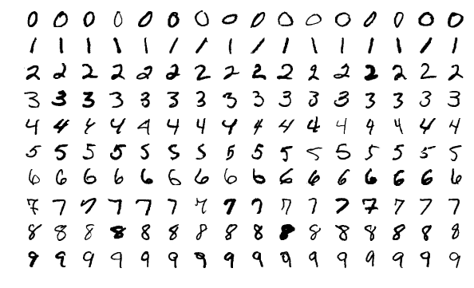
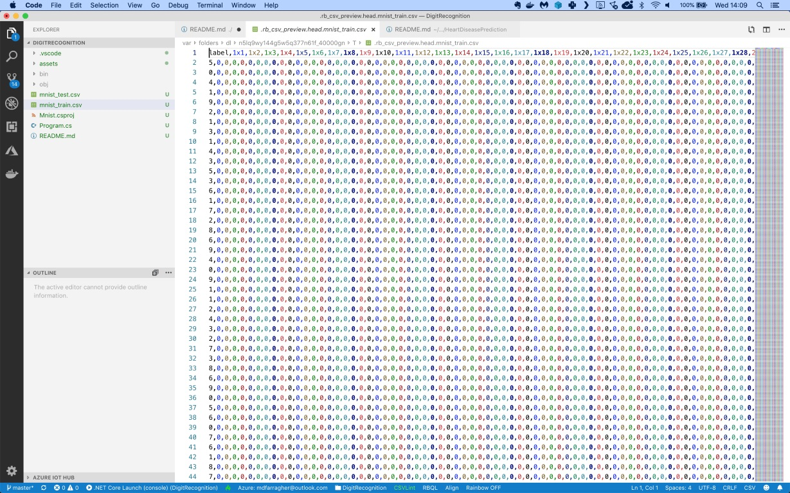
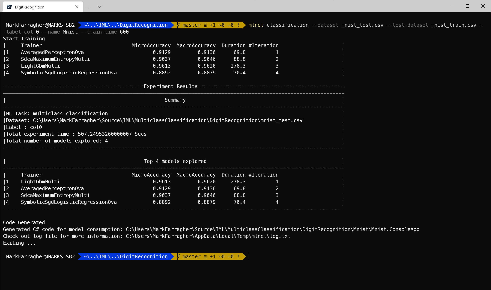
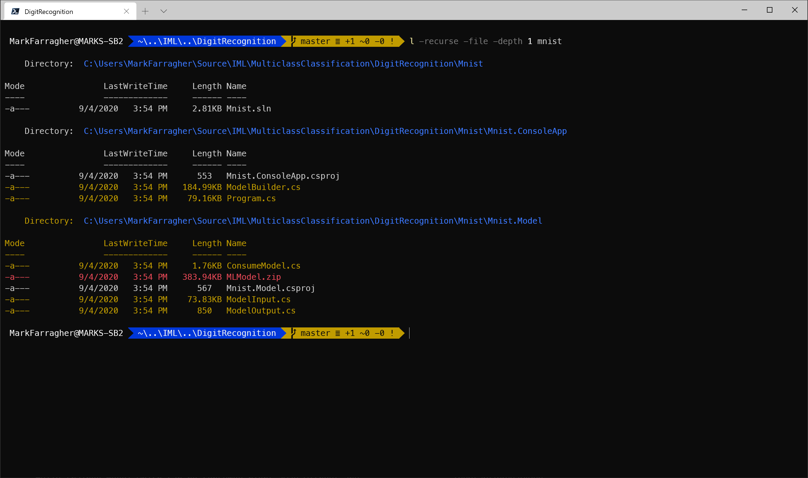
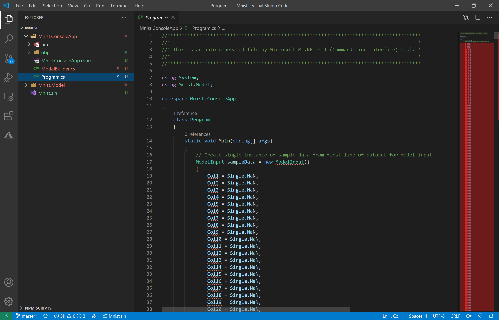
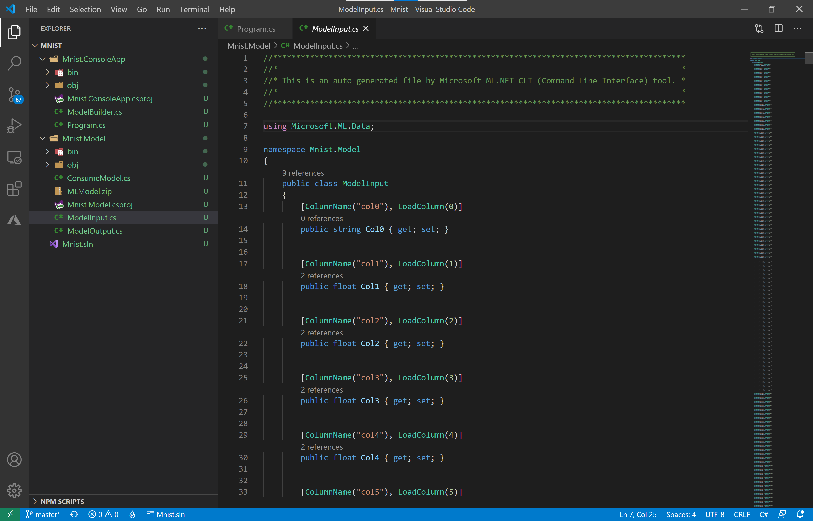
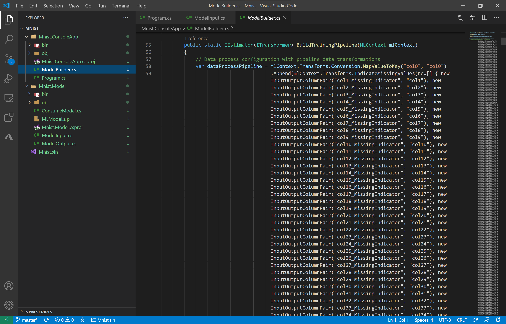
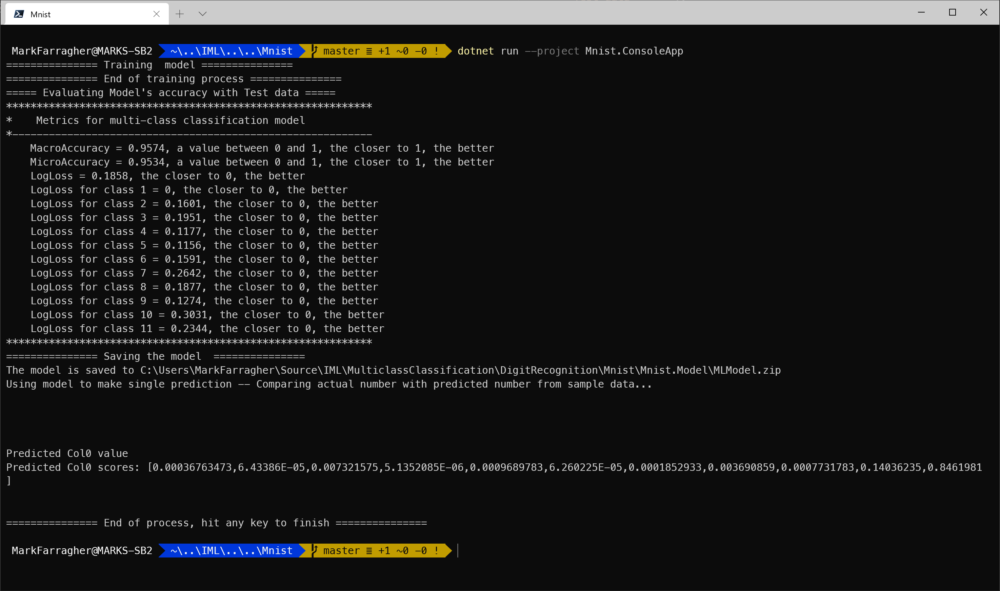

# Assignment: Recognize handwritten digits

Digit recognition systems are machine learning models that are trained to recognize digits from many different sources like emails, bank cheques, papers, PDF documents, images, etc. These systems have many real-world applications, for example in processing bank cheques, scanning PDF documents, recognizing handwriting notes on tablets, read number plates of vehicles, process tax forms and so on.

Handwriting recognition is a hard challenge to solve because handwritten digits are not always the same size and orientation, and handwriting also tends to differ from person to person. Many people write a single digit with a variety of different handwriting styles. 

MNIST is the de facto "Hello World" dataset of computer vision. Since its release in 1999, this classic dataset of handwritten digits has served as the basis for benchmarking classification algorithms. As new machine learning techniques emerge, MNIST remains a reliable resource for researchers and learners alike.

The dataset was created by mixing handwriting samples from American Census Bureau employees and American high school students. The black and white images of handwritten digits were normalized to fit into a 28x28 pixel bounding box and anti-aliased to introduce grayscale levels.



The dataset contains 60,000 training images and 10,000 testing images. 

In this assignment, you are going to build a machine learning model that learns to recognize handwriting by training on the MNIST dataset. 

Think you're up to the challenge? 

Don't underestimate the complexity of this assignment. Look at these sample digits from the dataset:


Are you able to identify each one? It probably won’t surprise you to hear that the human error rate on MNIST digit recognition is around 2.5%.

Your goal in this assignment is to try and achieve superhuman performance. This means the accuracy of your machine learning model must be above 0.975. 

## Get the dataset

Let's start by downloading the dataset. 

We will not use the original MNIST data because it's stored in a nonstandard binary format.

Instead, we'll use these excellent [CSV files](https://www.kaggle.com/oddrationale/mnist-in-csv/) prepared by Daniel Dato on Kaggle.

Create a Kaggle account if you don't have one yet, then download **mnist_train.csv** and **mnist_test.csv** and save them in your project folder.

The data files look like this:



They are CSV files with 785 columns:

* The first column contains the label. It tells us which one of the 10 possible digits is visible in the image.
* The next 784 columns are the pixel intensity values (0..255) for each pixel in the image, counting from left to right and top to bottom.

You are going to build a multiclass classification machine learning model and train it on all 785 columns, and then makes a prediction for each digit in the test dataset.

To start, please open a console window. You are going to create a folder to hold the files of this assignment:

```bash
mkdir DigitRecognition
cd DigitRecognition
```

Also make sure to copy the dataset files into this folder. 

## Train the model

Now you're ready to start training a machine learning model. Type the following command in your console window:

```bash
mlnet classification --dataset mnist_test.csv --test-dataset mnist_train.csv --label-col 0 --name Mnist --train-time 600
```

There's a new parameter that we haven't seen before:

* --name: the name for output project or solution to create. Default is SampleClassification.

And note the --label-col parameter. Instead of providing a column name, we're specifying the column index instead.

Also note the --train-time parameter. MNIST is a very large dataset, so we are cranking the training time up to 10 minutes.

Here's what I get after 5 minutes of training:


You can see that at the point of the screenshot the tool has tried out the 2 machine learning algorithms listed in the **Training** column, with the performance of each algorithm listed in the **MicroAccuracy** and **MacroAccuracy** columns.

In the screenshot, the best algorithm is AveragedPerceptronOva which achieved a MicroAccuracy of 0.9129. This happened in experiment 1. 

The tool continues to try out algorithms for 10 minutes and then selects the winning algorithm.

Here's what I get:



After 4 experiments, the tool has selected LightGbmMulti as the winning algorithm. It achieved a winning MicroAccuracy value of 0.9613.

This is an amazing result because the human accuracy level for this task is 0.9750. We are within one percent of human performance, and this after only 10 minutes of training!

## Inspect the C# code

Let's check the files agail that the CLI tool has created. Run the following Powershell command on the console:

```bash
l -recurse -file -depth 1 mnist
```

You'll see the following output:



There are three folders:

* **Mnist**: The solution folder for the generated app containing a single SLN file for Visual Studio.
* **Mnist/Mnist.ConsoleApp**: A console project that consumes the fully-trained model to make a prediction. There's also a **ModelBuilder.cs** file which can train the model from scratch.
* **Mnist/Mnist.Model**: A library project with helper classes for training and consuming the model. There's also a ZIP file with a saved copy of the fully-trained model which can be consumed right away without any further training. 

This is the same folder structure we have seen every time, but now all folders and projects are called 'Mnist' instead. This is because we provided the --name parameter to override the default 'SampleClassification' name.

### The Mnist.ConsoleApp project

Let's do a quick scan of the projects to see if we find anything new in the source code.

Go to the Mnist folder and open Visual Studio code:

```bash
cd mnist
code .
```

In Visual Studio Code, select the **Mnist.ConsoleApp/Program.cs** file. You'll see something like this:



Look at the **Main** method. The tool has explicitly defined every single column in the dataset, all 784 of them. So now we're stuck with a **ModelInput** class full of properties named Col1, Col2, Col3... al the way up to Col784.

That's not very useful. 

And there's no need for this, because ML.NET has the capability to load multiple columns into an array. And that's exactly what we want here: to load all pixel values into a single array. 

So let's hack the code and make some improvements.

We'll start by opening **Mnist.Model/ModelInput.cs** file in Visual Studio Code. You'll see the following horrible code:



This is only a small part of the code. There are 784 property declarations in this single class.

Let's fix that right now. Replace the entire class with this:

```csharp
public class ModelInput
{
    [LoadColumn(0)]
    public string Number;

    [LoadColumn(1, 784)]
    [VectorType(784)]
    public float[] PixelValues;
}
```

The **LoadColumn(1,784)** attribute is where the magic happens. It tells the ML.NET library to load columns 1 to 784 into a single float array called **PixelValues**.

Much better!

Unfortunately we have just changed the input schema of the machine learning model. This is a breaking change, meaning that we can no longer use the ZIP file with the fully trained model. 

We're going to have to retrain the model from scratch. 

So let's go back to the **Mnist.ConsoleApp/Program.cs** file and fix the **Main** method.

Remove all the existing code and replace with this:

```csharp
static void Main(string[] args)
{
    // train the model from scratch
    ModelBuilder.CreateModel();

    // create a sample digit filled with random noise
    var digit = new ModelInput()
    {
        Number = null,
        PixelValues = new float[784]
    };
    var rnd = new Random();
    for (var i=0; i<784; i++)
        digit.PixelValues[i] = rnd.Next(255);

    // Make a single prediction on the sample data and print results
    var prediction = ConsumeModel.Predict(digit);

    Console.WriteLine("Using model to make single prediction -- Comparing actual number with predicted number from sample data...\n\n");
    Console.WriteLine($"\n\nPredicted Col0 value {prediction.Prediction} \nPredicted Col0 scores: [{String.Join(",", prediction.Score)}]\n\n");
    Console.WriteLine("=============== End of process, hit any key to finish ===============");
    Console.ReadKey();
}
```

The **CreateModel** call at the start will ensure that we retrain the model from scratch and get a working ZIP file. 

The next code block declares a new test digit and fills it with random pixels. 

And finally, we call **ConsumeModel.Predict** to make a prediction and display the results. 

That concludes our changes to the **Mnist.Console** project. But we're not done yet!

### The ModelBuilder class

The machine learning pipeline is a bit of a mess right now. 

Check this out, this is the **BuildTrainingPipeline** method:



It's a massive mess of **IndicateMissingValues**, **ConvertType** and **ReplaceMissingValues** components. And there's no need for that because no pixel values are actually missing in the dataset.

So let's clean that up. Replace the entire method with this:

```csharp
public static IEstimator<ITransformer> BuildTrainingPipeline(MLContext mlContext)
{
    // map the label to a key
    return mlContext.Transforms.Conversion.MapValueToKey(
        outputColumnName: "Label", 
        inputColumnName: "Number")

        // concatenate all feature columns
        .Append(mlContext.Transforms.Concatenate(
            "Features", 
            "PixelValues"))
            
        // train the model with SDCA
        .Append(mlContext.MulticlassClassification.Trainers.LightGbm(
            labelColumnName: "Label", 
            featureColumnName: "Features"))

        // map the prediction back to a number
        .Append(mlContext.Transforms.Conversion.MapKeyToValue(
            outputColumnName: "PredictedLabel",
            inputColumnName: "Label"));
}
```

Here is a breakdown of the components in the pipeline:

* A **MapValueToKey** component that takes the label (which is an enumerated value) and convers it to a key: a value that the machine learning model can work with.  
* A **Concatenate** component which combines all input data columns into a single column called 'Features'. This is a required step because ML.NET can only train on a single input column.
* The **LightGbm** training algorithm that was discovered by the ML.NET CLI tool. 
* A final **MapKeyToValue** component that convers the key that the model predicts back to its corresponding label value.

The **MapValueToKey** and **MapKeyToValue** components are mandatory when training a multiclass classifier on a label column. They perform one-hot encoding internally to ensure that the model correctly processes the label data.

We're almost done. 

All that remains is for us to fix the **EvaluateModel** method. Here's what the tool generated:

```csharp
private static void EvaluateModel(MLContext mlContext, ITransformer mlModel, IDataView testDataView)
{
    // Evaluate the model and show accuracy stats
    Console.WriteLine("===== Evaluating Model's accuracy with Test data =====");
    IDataView predictions = mlModel.Transform(testDataView);
    var metrics = mlContext.MulticlassClassification.Evaluate(predictions, "col0", "Score");
    PrintMulticlassClassificationMetrics(metrics);
}
```

This is almost correct, but we have to replace "col0" with "Label" because we renamed the label column. 

So the line that initializes the **metrics** variable should be changed to this:

```csharp
var metrics = mlContext.MulticlassClassification.Evaluate(predictions, "Label", "Score");
```

Okay, that's all!

Now execute the following command on the console:

```bash
dotnet run --project Mnist.ConsoleApp
```

If you have made all the changes correctly, you'll see this:



The model gets trained from scratch and evaluated, and we get a new ZIP file with the new model schema.

We're now achieving a micro accuracy of 95.34%. This is slightly less than our previous micro accuracy of 96.13%, but small changes like this are possible when we refactor code and retrain the model.

## Observations

You can see that the ML.NET CLI tool is not smart enough to realize that it is training on pixel data. It encounters 784 input columns in the dataset and simply creates 784 corresponding properties in the **ModelInput** class. 

Its up to us to intelligently design the machine learning pipeline and the input and output classes to load the data as efficiently as possible, and produce clean and maintainable C# code. 

But take a moment to recognize what the tool achieved: an accuracy of more than 95%. It came within spitting distance of human performance. 

## Improve the model

Now see if you can improve the model further. 

Remember, the CLI tool only had time to try out 4 different models during its 10-minute training time. This is not a lot, so there may be even better undiscovered algorithms out there. 

So go and run the tool again, but now for longer than 10 minutes. Can you find new machine learning pipelines that perform much better on the dataset?

Can you achieve superhuman performance?

## Homework

Once you've found your best-performing model, please report your results online to get entered into our hall of fame.


Click the following link to access the online submission form on your PC or mobile: 

[https://forms.office.com/Pages/ResponsePage.aspx....](https://forms.office.com/Pages/ResponsePage.aspx?id=cDwqJ-Givk-T_qyHkmGIbU3xYGpQDIZMlmak2FZVNMJUOUdYUkU5SFgwNjVZUEE2NFFKMlJMMEVLSi4u)

And then in the form please report the following:

* Your name
* The dataset you're using (= **MNIST Handwriting**)
* The columns you used in your best model
* The learning algorithm you used in your best model
* The metric you used to evaluate your model (= **MicroAccuracy**)
* The micro accuracy value of your best model

I will periodically compile all submissions into a top-10 hall of fame and share the list in my courses and on social media. 

You'll be famous!

And feel free to brag about your results in our Slack group ;) 

Good luck!
