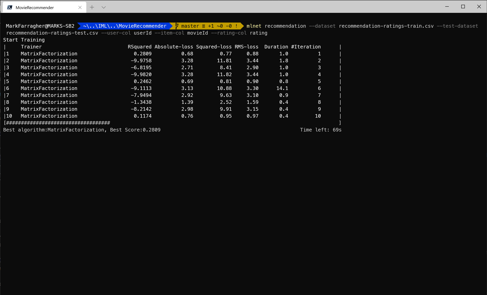
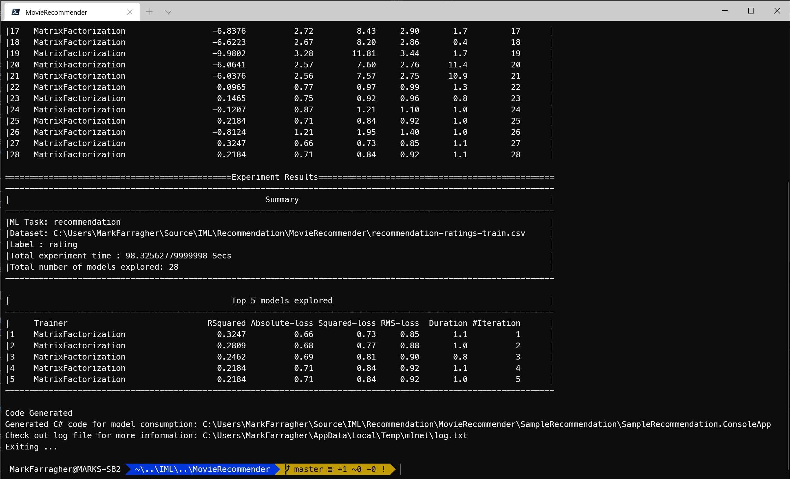
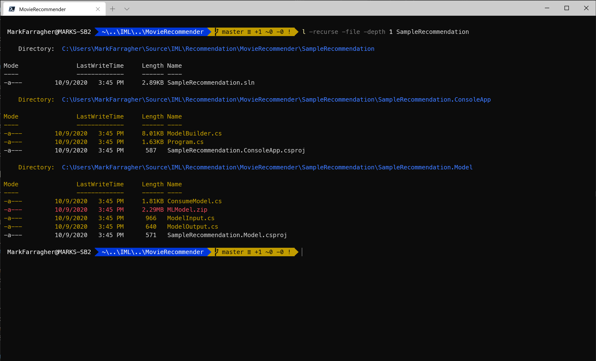
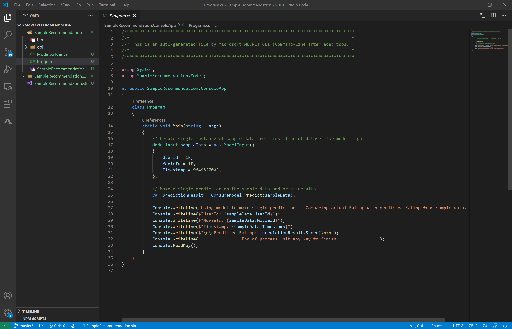
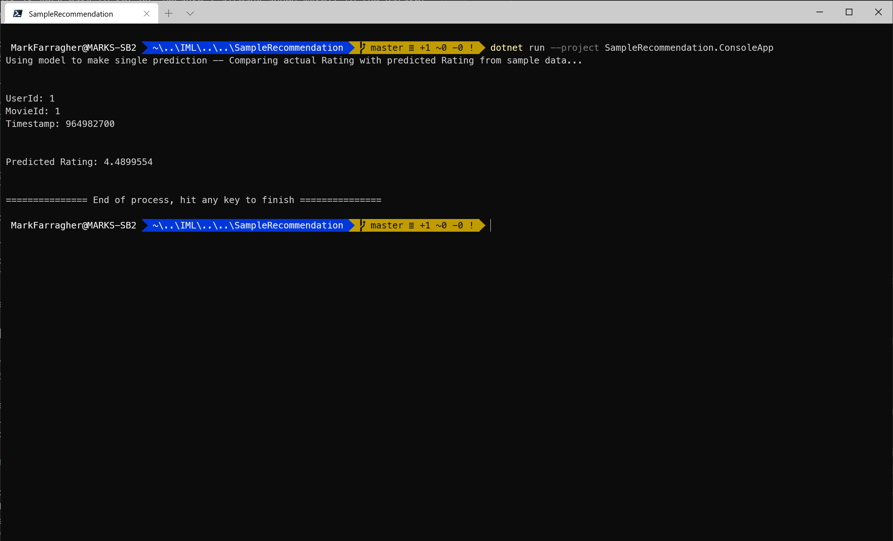

# Assignment: Recommend movies to me

MovieLens is a web-based recommender system and virtual community that recommends movies for its users to watch, based on their film preferences using collaborative filtering of members' movie ratings and movie reviews. It contains about 11 million ratings for about 8500 movies.

MovieLens was created in 1997 by GroupLens Research, a research lab in the Department of Computer Science and Engineering at the University of Minnesota, in order to gather research data on personalized recommendations.

MovieLens has open-sourced their dataset and made it freely available to education, research, and industry. It is downloaded hundreds of thousands of times each year, reflecting its use in popular press programming books, traditional and online courses, and software. 

In this assignment, you will use the MovieLens 100K dataset. This dataset is comprised of 100,000 ratings, ranging from 1 to 5 stars, from 943 users on 1682 movies. It has been cleaned up so that each user has rated at least 20 movies. 

Your objective is to train a recommendation model on the MovieLens dataset, and then use the fully-trained model to answer two very important questions:

* Which rating would I give to the James Bond movie 'GoldenEye'? 
* Which top-5 movies would you recommend to me to watch next?

## Get the dataset

To start, please open a console window. You are going to create a folder to hold the files of this assignment:

```bash
mkdir MovieRecommender
cd MovieRecommender
```

Next, grab the MovieLens 100K dataset. Please download the [training file](https://github.com/mdfarragher/IML/blob/master/Recommendation/MovieRecommender/recommendation-ratings-train.csv), [testing file](https://github.com/mdfarragher/IML/blob/master/Recommendation/MovieRecommender/recommendation-ratings-test.csv), and the [movie dictionary](https://github.com/mdfarragher/IML/blob/master/Recommendation/MovieRecommender/recommendation-movies.csv) and save these files in your project folder. 

You now have 100,000 movie ratings with 99,980 set aside for training and 20 for testing. 

The training and testing files are in CSV format and look like this:


There are only four columns of data:

* The ID of the user
* The ID of the movie
* The movie rating on a scale from 1–5
* The timestamp of the rating

There's also a movie dictionary:


This file has three columns of data:

* The ID of the movie
* The title of the movie
* The list of genres for the movie

You are going to build an app that trains a recommendation model on these datafiles and then generates recommendations for me, your humble trainer.

## Train the model

We're going to use the ML.NET CLI tool to train a recommendation model and write all corresponding C# code, just like we did in earlier exercises. 

Please run the following command in your console window:

```bash
mlnet recommendation --dataset recommendation-ratings-train.csv --test-dataset recommendation-ratings-test.csv --user-col userId --item-col movieId --rating-col rating
```

Note that we're now using the **recommendation** command. There are also a couple of new parameters that we haven't seen before:

* --user-col: the name of the data column that contains the user IDs.
* --item-col: the name of the data column that contains the movie IDs.
* --rating-col: the name of the data column that contains the rating.

Here's what I get after a couple of seconds of training:



You can see that at the point of the screenshot the tool has tried out 10 different machine learning pipelines. Note in the **Training** column that every experiment uses the **MatrixFactorization** algorithm. This is what we expect, because the ML.NET library only has this one single algorithm to train review recommendation models. 

Each pipeline is ranked by **R-Squared**, with the **MAE**, **MSE** and **RMSE** also listed. 

In the screenshot, the best pipeline achieved an R-Squared value of 0.2809 and a MAE of 0.68. This means the model's predictions were only off by slightly over half a rating point. 

The tool continues to try out pipelines for 100 seconds and then selects the winning solution.

Here's what I get:



After 28 experiments, the tool has found the best pipeline with a winning R-Squared value of 0.3247 and a MAE of 0.66. 

So we can expect this model to generate predictions that are off by roughly half a rating point, on average. That's not bad at all. 

## Inspect the C# code

Let's check the files that the CLI tool has created. Run the following Powershell command on the console:

```bash
ls -recurse -file -depth 1 SampleRecommendation
```

You'll see the following output:



There are three folders:

* **SampleRecommendation**: The solution folder for the generated app containing a single SLN file for Visual Studio.
* **SampleRecommendation/SampleRecommendation.ConsoleApp**: A console project that consumes the fully-trained model to make a prediction. There's also a **ModelBuilder.cs** file which can train the model from scratch.
* **SampleRecommendation/SampleRecommendation.Model**: A library project with helper classes for training and consuming the model. There's also a ZIP file with a saved copy of the fully-trained model which can be consumed right away without any further training. 

This is the same folder structure we have seen every time, but now all folders and projects are called 'SampleRecommendation' instead. 

### The SampleRecommendation.ConsoleApp project

Let's do a quick scan of the projects to see if we find anything new in the source code.

Go to the SampleRecommendation folder and open Visual Studio code:

```bash
cd SampleRecommendation
code .
```

In Visual Studio Code, select the **SampleRecommendation.ConsoleApp/Program.cs** file. You'll see something like this:




Note how the **ModelInput** class now contains **UserId** and **MovieId** properties. This is all we need to provide to make a rating prediction for a specific user and movie (the Timestamp is ignored).

The code looks exactly the same as in previous assignments. 

Now open the **SampleRecommendation.Model/ModelInput.cs** file in Visual Studio Code. You'll see this:

```csharp
public class ModelInput
{
    [ColumnName("userId"), LoadColumn(0)]
    public float UserId { get; set; }

    [ColumnName("movieId"), LoadColumn(1)]
    public float MovieId { get; set; }

    [ColumnName("rating"), LoadColumn(2)]
    public float Rating { get; set; }

    [ColumnName("timestamp"), LoadColumn(3)]
    public float Timestamp { get; set; }
}
```

Exactly like we've seen many times before: one property per dataset column, with **LoadColumn** attributes to specify from which CSV column the data should be loaded. 

Note how the property name follow the .NET convention of Pascal casing, with **ColumnName** attributes preserving the original column name from the CSV file. 

Now let's check out the **SampleRecommendation.Model/ModelOutput.cs** file:

```csharp
public class ModelOutput
{
    public float Score { get; set; }
}
```

There's only a single **Score** property which contains the predicted rating generated by the model.

### The ModelBuilder class

Now let's check out the machine learning pipeline. 

The **BuildTrainingPipeline** method in the **ModelBuilder** class looks like this:

```csharp
public static IEstimator<ITransformer> BuildTrainingPipeline(MLContext mlContext)
{
    // Data process configuration with pipeline data transformations 
    var dataProcessPipeline = mlContext.Transforms.Conversion.MapValueToKey("userId", "userId")
                                .Append(mlContext.Transforms.Conversion.MapValueToKey("movieId", "movieId"));
    // Set the training algorithm 
    var trainer = mlContext.Recommendation().Trainers.MatrixFactorization(new MatrixFactorizationTrainer.Options() { NumberOfIterations = 40, LearningRate = 0.1f, ApproximationRank = 64, Lambda = 0.1f, LossFunction = MatrixFactorizationTrainer.LossFunctionType.SquareLossRegression, Alpha = 1E-06f, C = 0.01f, LabelColumnName = "rating", MatrixColumnIndexColumnName = "userId", MatrixRowIndexColumnName = "movieId" });

    var trainingPipeline = dataProcessPipeline.Append(trainer);

    return trainingPipeline;
}
```

This is a very small pipeline with only a few components:

* A **MapValueToKey** component that takes the user ID (which is an enumerated value) and convers it to a key: a value that the machine learning model can work with.  
* A second **MapValueToKey** component that takes the movie ID and convers it to a key.  
* A **MatrixFactorization** training algorithm to train a recommendation model on the data. 

We should not be surprised by the **MapValueToKey** components. The user- and movie IDs are enumerations and need to be mapped to keys before we can train a machine learning model on them. 

But note that there is no **MapKeyToValue** component. We don't need it because the rating prediction is not an enumeration. It's a numeric value that doesn't need any further processing. 

Also note that the MatrixFactorization algorithm has a ton of hyperparameters: **NumberOfIterations**, **LearningRate**, **ApproximationRank**, **Lambda**, **Alpha** and **C**. All these parameter values were discovered by the ML.NET CLI tool during auto-training. 

## Make recommendations

Okay, now let's tweak the app to make a useful prediction. I want you to tell me if I would like the James Bond movie 'Goldeneye'.

This is very easy to set up, because I already added myself to the dataset as user 999. And the movie 'Goldeneye' has an ID of 10. 

So all you need to do is change the prediction code in the **Program.cs** file as follows:

```csharp
// predict the rating Mark would give to Goldeneye
ModelInput sampleData = new ModelInput()
{
    UserId = 999F,  // mark
    MovieId = 10F   // goldeneye
};
```

Now execute the app to make the prediction:

```bash
dotnet run --project SampleRecommendation.ConsoleApp
```

Here's what I get:



The model predicts that I would give a rating of 4.49 to the movie Goldeneye. Keep in mind that this prediction has an average error of plus or minus 0.66. 

Is this accurate? 

Well, I've seen the movie and I guess it was ok. I'd give it a rating of between 3 and 4 and would watch it on a rainy day if there was nothing better on TV. 

But I really do prefer the more recent Bond movies. Daniel Craig in Casino Royale was magnificent. 🙂

## Homework

You can't really improve this pipeline any further. There's only one algorithm to choose from (MatrixFactorization) and all the hyperparameters have already been optimized by the CLI tool. 

But feel free to run the CLI tool for longer than 100 seconds and see if you can get even better MAE and RMSE values. 

For your homework, I want you to do something else. I want you to predict which 10 movies I should watch next. 

To pull this off, you'll need to modify the **Program.cs** file to do the following:

* Make predictions for user 999 (me) and every single movie in the dataset. 
* Sort the list of predictions from high to low.
* Grab the first 10 predictions from the list, together with their corresponding movie ID values.
* Convert the movie IDs to movie titles. You can use the file **recommendation-movies.csv** to map any ID to a title.

This should produce the 10 movies that the model believes I would give the highest ratings to. 

Modify the source code, run your app, and let me know in our Slack channel which 10 movies I should be watching next.

I'll let you know if I agree with your predictions!

